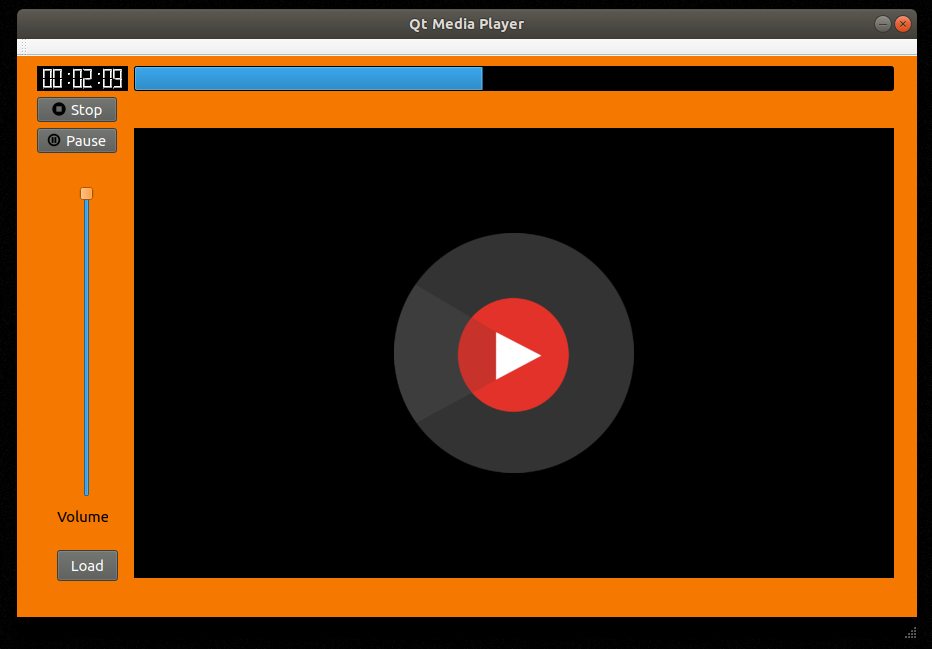

# Qt Media Player
App build in C++ with Qt Creator which reproduces audio and video files. 

# About this Project

This app is build with pure C++ with the framework Qt Creator 5.12. 

# Getting Started

**Prerequisites**

To run this project, you'll need to have g++ and Qt Creator installed.

**Installing**

To install the g++ compiler for C++ code, run this on terminal:

	$ sudo apt install g++
	
Download and Install Qt from [here](https://www.qt.io/download?hsCtaTracking=f24f249b-61fb-4dec-9869-50512342f8d9%7Cf3adf380-4740-4f7e-9e49-d06fa99445fa).

After that, clone this Repository:

    $ git clone https://github.com/awcasella/Qt-Media-Player.git
  
Launch Qt Creator, and open the file "AudioPlayer/AudioPlayer.pro". This will open all the related files of this project in Qt.

To run the project, click on the green triangle on the left bottom part of the window. This will make the window pop just link in the screenshot above. 

You can test it with the .mp3 file in this repo.

# Built With
- [Qt](https://www.qt.io): Cross platform software development for embedded systems.

# Note

Even though, the files inside project folder are called "AudioPlayer", they can reproduce video files as well.
